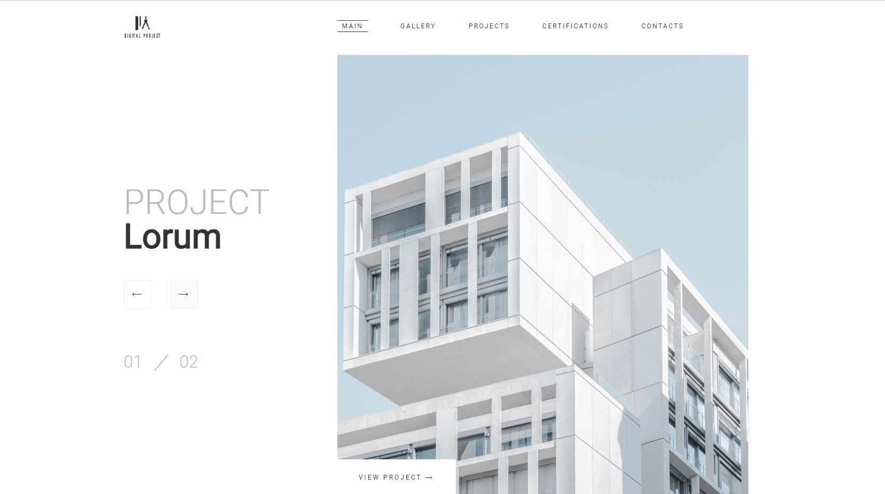

# Digital Project - сайт архитектурной компании

## О сайте

Этот веб-сайт представляет собой портфолио для архитекторов, демонстрирующее их проекты и работы.

## Как использовать

Сайт содержит галерею проектов с фотографиями, описаниями и ссылками на дополнительную информацию.
Для навигации по сайту используйте меню в верхней части страницы.

### Меню

- [x] Main - основная страница сайта
- [x] Gallery - галерея проектов
- [x] Projects - проекты с фото и подробным описанием
- [x] Certifications - фото сертификатов
- [x] Contacts - форма для связи с архитекторами

## Технические детали

:pushpin: Сайт использует HTML, CSS для создания адаптивного и функционального интерфейса.

:pushpin: Изображения оптимизированы для веб.

:pushpin: Проект размещен на GitHub Pages, что обеспечивает бесплатный хостинг и возможность для совместной работы над кодом.

---

:link: Файлы проекта доступны на GitHub по адресу: https://github.com/LizavetaKatkova/group-project-1-/tree/main
